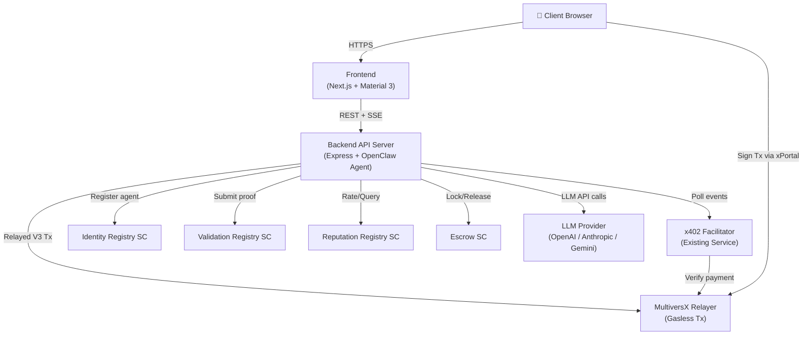

# 🔬 Market Research Bot — Comprehensive Implementation Plan

*Version 2.0 — MultiversX Native — Zero-to-Production in 5 Minutes*

---

## 1. Product Definition

### What We Are Building
A **new open-source repository** (`clawdbot-market-research`) that is a complete, deployable, monetizable AI agent product. It is not a library or an SDK — it is a **finished product template** that a developer clones, configures in a CLI wizard, and deploys to a VPS with one command. The agent does market research. It earns money on MultiversX via x402 micropayments.

### What The Developer Gets
```
clawdbot-market-research/
├── backend/          ← The OpenClaw agent + x402 API server
├── frontend/         ← Material Design 3 chat landing page
├── scripts/          ← CLI setup, wallet generation, on-chain registration
├── infra/            ← Docker Compose, Caddyfile, provision.sh, deploy.sh
├── agent.config.json ← The ONLY file the developer edits
└── README.md         ← 5-minute setup walkthrough
```

### What The End Client Sees
A beautiful web landing page at `https://research.mybot.com` with:
1. A clean chat interface (Material Design 3).
2. Ability to type research queries and upload PDFs/CSVs for context.
3. An inline payment prompt powered by MultiversX (xPortal QR code or wallet deep-link).
4. Real-time streaming of the agent's research progress.
5. A "Download as PDF" button for the finished research document.

---

## 2. Architecture



### Component Mapping to Existing Code

| Component | Source | What We Reuse |
|:---|:---|:---|
| Agent Core Loop | `moltbot-starter-kit/src/index.ts` | Payment listener, job handler, facilitator polling |
| x402 Payment Gating | `moltbot-starter-kit/src/facilitator.ts` | `prepare()`, `settle()`, `onPayment()` |
| On-Chain Identity | `moltbot-starter-kit/src/skills/identity_skills.ts` | `registerAgent()`, `updateAgent()`, `getAgent()` |
| Proof of Work | `moltbot-starter-kit/src/skills/validation_skills.ts` | `submitProof()`, `initJob()`, `getJobData()` |
| Reputation | `moltbot-starter-kit/src/skills/reputation_skills.ts` | `submitFeedback()`, `getReputation()` |
| Escrow | `moltbot-starter-kit/src/skills/escrow_skills.ts` | `deposit()`, `release()`, `refund()` |
| Transfers | `moltbot-starter-kit/src/skills/transfer_skills.ts` | `transferEGLD()`, `transferESDT()` |
| Discovery | `moltbot-starter-kit/src/skills/discovery_skills.ts` | `discoverAgents()`, `getBalance()` |
| Manifest Builder | `moltbot-starter-kit/scripts/build_manifest.ts` | Builds on-chain manifest JSON |
| Wallet Generator | `moltbot-starter-kit/scripts/generate_wallet.ts` | Creates `wallet.pem` |
| On-Chain Registration | `moltbot-starter-kit/scripts/register.ts` | Full registration flow |
| x402 Facilitator Service | `x402_integration/x402_facilitator/` | Express server verifying x402 challenges |
| Relayer Service | `x402_integration/multiversx-openclaw-relayer/` | Gasless Relayed V3 txs |

**Payment flow is MultiversX-only.** No Solana, no Base, no Ethereum.

---

## 3. Frontend Specification

### Technology
- **Framework:** Next.js 15 (App Router, static export for simple hosting).
- **Design System:** Google Material Design 3 via `@mui/material` (Material UI v6) or Tailwind + custom M3 tokens.
- **Wallet Integration:** `@multiversx/sdk-dapp` for xPortal wallet connection and transaction signing.

### Pages

| Route | Purpose |
|:---|:---|
| `/` | Landing page: hero section explaining the bot's capabilities, pricing, and a "Start Research" CTA. |
| `/chat` | The main chat interface. Full-screen conversational UI with file upload dropzone. |

### Chat Interface Features
- **Message Types:** User text, bot text (streamed via SSE), bot "thinking" indicator, payment request card, file attachment card, research document card.
- **Payment Flow:** When the backend returns `HTTP 402`, the frontend renders a **Payment Card** inside the chat with:
  - Amount and token (e.g., "0.50 USDC").
  - A "Pay with xPortal" button that triggers `@multiversx/sdk-dapp` transaction signing.
  - A QR code for mobile scanning.
  - Once the tx is confirmed on-chain, the frontend sends a "payment confirmed" event to the backend, and the agent starts executing.
- **File Upload:** Drag-and-drop zone supporting PDF, CSV, TXT, DOCX. Files are sent to `POST /api/upload` and stored locally for the agent's context.
- **Download:** When the agent completes, the chat renders a "Download Research Report (PDF)" card. The PDF is generated server-side using `puppeteer` or `pdfkit`.

---

## 4. Backend Specification

### API Routes

| Method | Route | Purpose |
|:---|:---|:---|
| `POST` | `/api/chat` | Send a user message. Returns SSE stream of agent responses. If payment is required, returns `402 Payment Required` with payment details. |
| `POST` | `/api/upload` | Upload a file (PDF/CSV). Returns a `fileId` for reference. |
| `GET` | `/api/chat/history` | Get chat history for a session. |
| `GET` | `/api/download/:jobId` | Download the finished research report as PDF. |
| `GET` | `/api/health` | Health check for monitoring. |
| `GET` | `/api/agent` | Returns the agent's on-chain profile (name, reputation score, price). |

### Agent Loop (Extended from `moltbot-starter-kit`)
1. **Receive** message via `/api/chat`.
2. **Check** if the user has an active paid session. If not → return `402` with payment URI.
3. **Execute** the research task using OpenClaw tools:
   - `search_web(query)` — Uses Tavily/Serper/Google API.
   - `scrape_page(url)` — Fetches and extracts text from a URL.
   - `read_uploaded_file(fileId)` — Reads uploaded context documents.
   - `generate_report(data)` — Synthesizes findings into a structured markdown document.
4. **Stream** partial results to the client via SSE.
5. **Finalize** and generate PDF.
6. **Prove** — Submit proof hash to `ValidationRegistry` via `validation_skills.submitProof()`.
7. **Notify** frontend that the report is ready for download.

---

## 5. Scripts & Automation (Every Step is a Script)

### Developer Lifecycle Scripts

| Script | Command | What It Does |
|:---|:---|:---|
| `setup.sh` | `npm run setup` | Interactive CLI wizard: asks for LLM API key, price per query, bot name → generates `.env`, `agent.config.json`, and `wallet.pem`. |
| `generate_wallet.ts` | Called by `setup.sh` | Creates a new MultiversX wallet and writes `wallet.pem`. |
| `check_balance.ts` | `npm run balance` | Checks the agent wallet's EGLD/USDC balance. |
| `fund.ts` | `npm run fund` | Requests devnet faucet tokens (devnet only). |
| `register.ts` | `npm run register` | Registers the agent on the Identity Registry SC. Mints the Soulbound Agent NFT and publishes the manifest. |
| `update_manifest.ts` | `npm run update` | Updates the on-chain manifest without re-registering. |
| `dev.sh` | `npm run dev` | Starts both frontend (port 3000) and backend (port 4000) locally with hot-reload. |
| `build.sh` | `npm run build` | Builds frontend (Next.js static export) and compiles backend TypeScript. |
| `provision.sh` | `npm run provision -- root@IP` | SSHs into a fresh Ubuntu 24.04 VPS and installs: Docker, Docker Compose, UFW (ports 80/443/SSH), Fail2Ban, non-root user `moltbot`. |
| `deploy.sh` | `npm run deploy -- root@IP domain.com` | SCPs the project to the VPS, sets up the Caddyfile with the provided domain, and runs `docker compose up -d`. |
| `destroy.sh` | `npm run destroy -- root@IP` | SSHs into VPS and runs `docker compose down -v`, removes project files. |
| `logs.sh` | `npm run logs -- root@IP` | SSHs into VPS and tails `docker compose logs -f`. |

### Hosting Automation Detail

#### `provision.sh` (Run Once on a Fresh VPS)
```bash
#!/bin/bash
# Usage: ./provision.sh root@your-vps-ip

VPS=$1
ssh $VPS << 'REMOTE'
  # 1. System updates
  apt-get update && apt-get upgrade -y
  
  # 2. Create non-root user
  useradd -m -s /bin/bash moltbot
  usermod -aG sudo moltbot
  
  # 3. SSH hardening
  sed -i 's/PermitRootLogin yes/PermitRootLogin no/' /etc/ssh/sshd_config
  sed -i 's/#PasswordAuthentication yes/PasswordAuthentication no/' /etc/ssh/sshd_config
  systemctl restart sshd
  
  # 4. Firewall
  ufw default deny incoming
  ufw default allow outgoing
  ufw allow 22/tcp
  ufw allow 80/tcp
  ufw allow 443/tcp
  ufw --force enable
  
  # 5. Fail2Ban
  apt-get install -y fail2ban
  systemctl enable fail2ban
  
  # 6. Docker
  curl -fsSL https://get.docker.com | sh
  usermod -aG docker moltbot
  
  # 7. Docker Compose plugin
  apt-get install -y docker-compose-plugin
REMOTE
echo "✅ VPS provisioned. Deploy with: npm run deploy -- moltbot@$VPS domain.com"
```

#### `docker-compose.yml`
```yaml
services:
  backend:
    build: ./backend
    env_file: .env
    volumes:
      - ./wallet.pem:/app/wallet.pem:ro
      - uploads:/app/uploads
      - reports:/app/reports
    restart: unless-stopped
    networks:
      - internal

  frontend:
    build: ./frontend
    restart: unless-stopped
    networks:
      - internal

  caddy:
    image: caddy:2-alpine
    ports:
      - "80:80"
      - "443:443"
    volumes:
      - ./infra/Caddyfile:/etc/caddy/Caddyfile:ro
      - caddy_data:/data
      - caddy_config:/config
    restart: unless-stopped
    networks:
      - internal

volumes:
  uploads:
  reports:
  caddy_data:
  caddy_config:

networks:
  internal:
```

#### `Caddyfile`
```caddyfile
{$DOMAIN} {
    # Frontend
    handle /* {
        reverse_proxy frontend:3000
    }
    # Backend API
    handle /api/* {
        reverse_proxy backend:4000
    }
}
```

---

## 6. Complete Master Task List

### Phase 0: Repository Scaffolding
- [ ] Create new git repository `clawdbot-market-research`.
- [ ] Initialize monorepo structure: `backend/`, `frontend/`, `scripts/`, `infra/`.
- [ ] Copy (not submodule) relevant files from `moltbot-starter-kit` into `backend/`.
- [ ] Copy `multiversx-openclaw-skills` reference files into `backend/skills/`.
- [ ] Copy ABI files from `moltbot-starter-kit` (`identity-registry.abi.json`, `reputation-registry.abi.json`, `validation-registry.abi.json`).
- [ ] Create root `package.json` with all lifecycle scripts (`setup`, `register`, `dev`, `build`, `provision`, `deploy`, `logs`, `destroy`).
- [ ] Create `.gitignore` (ignore `wallet.pem`, `.env`, `node_modules`, `uploads/`, `reports/`).
- [ ] Create `agent.config.example.json` with documented defaults.
- [ ] Create `.env.example` with all required environment variables documented.

### Phase 1: Backend — Chat API Server
- [ ] Create `backend/src/server.ts`: Express server with CORS, body parsing, file upload (multer).
- [ ] Create `backend/src/routes/chat.ts`: `POST /api/chat` endpoint.
  - [ ] Session management (simple UUID-based, stored in-memory or SQLite).
  - [ ] Payment gate: check if the session has a valid paid job. If not, call `facilitator.prepare()` and return `HTTP 402` with payment details (amount, token, receiver address, payment URI).
  - [ ] If paid: invoke the OpenClaw agent and stream response via SSE.
- [ ] Create `backend/src/routes/upload.ts`: `POST /api/upload` endpoint for file uploads.
- [ ] Create `backend/src/routes/download.ts`: `GET /api/download/:jobId` to serve generated PDF.
- [ ] Create `backend/src/routes/agent.ts`: `GET /api/agent` returns public agent profile from on-chain data.
- [ ] Create `backend/src/routes/health.ts`: `GET /api/health` health check.
- [ ] Create `backend/src/agent/research-agent.ts`: The core OpenClaw agent with research tools.
  - [ ] Tool: `search_web(query)` — calls Tavily/Serper API.
  - [ ] Tool: `scrape_page(url)` — fetches and extracts clean text from a URL.
  - [ ] Tool: `read_uploaded_file(fileId)` — reads an uploaded PDF/CSV from disk.
  - [ ] Tool: `generate_report(sections)` — synthesizes a structured markdown report.
- [ ] Create `backend/src/agent/pdf-generator.ts`: Converts markdown research report to PDF.
- [ ] Create `backend/src/agent/proof-submitter.ts`: After report generation, hashes the PDF and calls `validation_skills.submitProof()`.
- [ ] Integrate `facilitator.onPayment()` listener to match payments to chat sessions.
- [ ] Create `backend/Dockerfile` (Node.js 22 slim, non-root user).

### Phase 2: Frontend — Material Design 3 Chat Landing Page
- [ ] Initialize Next.js 15 app in `frontend/` with App Router.
- [ ] Install Material UI v6 (`@mui/material`, `@mui/icons-material`, `@emotion/react`).
- [ ] Install MultiversX SDK (`@multiversx/sdk-dapp`).
- [ ] Create M3 theme: color tokens, typography (Inter/Roboto font), elevation system, dark mode support.
- [ ] Create `frontend/app/page.tsx`: Landing page.
  - [ ] Hero section: Bot name, description, pricing, reputation score (fetched from `GET /api/agent`).
  - [ ] "Start Research" CTA button → navigates to `/chat`.
  - [ ] Features grid: "Upload documents", "Real-time streaming", "Pay per query", "Download PDF".
- [ ] Create `frontend/app/chat/page.tsx`: Chat interface.
  - [ ] Message list component with auto-scroll.
  - [ ] Text input with send button.
  - [ ] File upload dropzone (drag-and-drop).
  - [ ] SSE connection to stream agent responses in real-time.
  - [ ] Payment Card component: renders when `402` is received.
    - [ ] Shows amount, token, and a "Pay with xPortal" button.
    - [ ] Uses `@multiversx/sdk-dapp` to sign and broadcast the transaction.
    - [ ] Polls for tx confirmation, then sends "payment_confirmed" to backend.
  - [ ] Research Report card: renders when agent completes, with "Download PDF" button.
  - [ ] Typing/thinking indicator.
- [ ] Create `frontend/Dockerfile` (Node.js 22, `next build && next start`).

### Phase 3: Developer CLI & Setup Wizard
- [ ] Create `scripts/setup.sh`: Interactive CLI wizard using `gum` (charmbracelet) or plain `read` prompts.
  - [ ] Ask: Bot name, description, price per query (in USDC), LLM provider (OpenAI/Anthropic/Gemini), LLM API key.
  - [ ] Generate `agent.config.json` from answers.
  - [ ] Generate `.env` from answers.
  - [ ] Call `scripts/generate_wallet.ts` to create `wallet.pem`.
  - [ ] Print: "Setup complete! Fund your wallet, then run `npm run register`."
- [ ] Create `scripts/register.ts`: Adapted from moltbot-starter-kit, registers agent on Identity Registry.
- [ ] Create `scripts/check_balance.ts`: Quick wallet balance check.
- [ ] Create `scripts/fund.ts`: Devnet faucet request.

### Phase 4: Infrastructure & Deployment Automation
- [ ] Create `infra/provision.sh`: Bash script to harden a fresh Ubuntu 24.04 VPS (UFW, Fail2Ban, Docker, non-root user).
- [ ] Create `infra/deploy.sh`: Bash script to SCP project to VPS, create `Caddyfile` with provided domain, run `docker compose up -d`.
- [ ] Create `infra/destroy.sh`: Bash script to tear down all containers and remove project files.
- [ ] Create `infra/logs.sh`: Bash script to tail Docker Compose logs on VPS.
- [ ] Create `infra/docker-compose.yml` with `backend`, `frontend`, and `caddy` services.
- [ ] Create `infra/Caddyfile` template (parameterized with `$DOMAIN`).
- [ ] Create `infra/backend.Dockerfile`.
- [ ] Create `infra/frontend.Dockerfile`.

### Phase 5: Documentation & README
- [ ] Write `README.md` with:
  - [ ] 30-second elevator pitch.
  - [ ] Architecture diagram (Mermaid).
  - [ ] Prerequisites (Node.js, Docker, a VPS, a domain, an LLM API key).
  - [ ] Step-by-step: Setup → Register → Deploy → Earn.
  - [ ] Environment variable reference table.
  - [ ] Customization guide: "How to change the agent's behavior" (edit tools in `research-agent.ts`).
  - [ ] Troubleshooting FAQ.
- [ ] Write `DEPLOYMENT_GUIDE.md` with detailed VPS security walkthrough.
- [ ] Write `CUSTOMIZATION_GUIDE.md` explaining how to fork this into a different bot (Content Bot, SEO Bot, etc.).

### Phase 6: Testing & Verification
- [ ] Backend unit tests: `jest` tests for chat routes, payment gating, agent tools.
- [ ] Frontend component tests: `vitest` + Testing Library for Chat, PaymentCard, FileUpload components.
- [ ] Integration test: Full flow on devnet (setup → register → start → chat → pay → receive report → verify on-chain proof).
- [ ] Manual E2E test: Deploy to a real VPS, visit the domain, complete a paid research query.

---

## 7. The 5-Minute Developer Journey

```bash
# 1. Clone the template (10 seconds)
git clone https://github.com/AIS-MultiversX/clawdbot-market-research my-research-bot
cd my-research-bot

# 2. Run the setup wizard (60 seconds)
npm run setup
# → Bot name? "CryptoResearchPro"
# → Price per query? "0.50 USDC"
# → LLM Provider? "OpenAI"
# → API Key? "sk-..."
# ✅ wallet.pem generated
# ✅ agent.config.json created
# ✅ .env created

# 3. Fund your wallet (30 seconds on devnet)
npm run fund
# ✅ 1 EGLD received from faucet

# 4. Register on-chain (30 seconds)
npm run register
# ✅ Agent registered on Identity Registry
# ✅ Soulbound NFT minted
# ✅ Manifest published

# 5. Deploy to VPS (120 seconds)
npm run provision -- root@your-vps-ip
npm run deploy -- moltbot@your-vps-ip research.yourbot.com
# ✅ VPS hardened (UFW, Fail2Ban, Docker)
# ✅ Containers built and started
# ✅ SSL certificate auto-provisioned by Caddy
# ✅ https://research.yourbot.com is LIVE

# 6. Share the link and start earning 🎉
```

---

## 8. Success Metrics

| Metric | Target |
|:---|:---|
| Time from `git clone` to live URL | < 5 minutes |
| Lines of code the developer must write | 0 (config only) |
| On-chain txs for registration | 1 (register) |
| Payment confirmation latency | < 6 seconds (MultiversX finality) |
| Agent response streaming start | < 2 seconds after payment |
| Monthly revenue per bot (estimate) | $50–$500 at $0.50/query |
