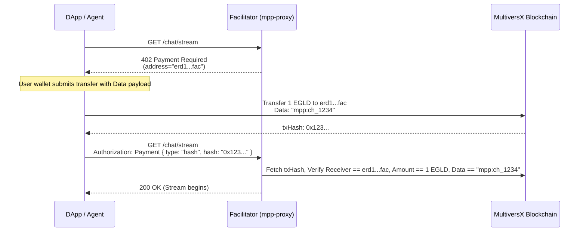

# MultiversX MPP Exhaustive Architectural Blueprint

**Status:** Architecture Design Phase
**Architects:** MVX Solution Architect, Integration Specialist, MVX Specs Writer

## 1. Executive Summary & Philosophy
This document serves as the absolute source of truth for integrating the **Machine Payments Protocol (MPP)** into the MultiversX Agentic Commerce Stack. MPP standardizes HTTP 402 `Payment Required` semantics. 

**Core Protocol Philosophy (The Data Tagging Approach):**
Learning from actual `x402` implementations and the constraints of the MultiversX network (where sweeping derived addresses costs gas), this blueprint uses **Data Payload Tagging** for every challenge. We actively reject the use of a centralized "Treasury Smart Contract" (due to complexity and storage limits) and "Derived HD Addresses" (due to gas sweeping costs). 
By instructing the AI Agent to append the exact `challenge.id` into the `data` field of a standard EGLD/ESDT transfer to a single Facilitator Wallet, idempotency and proof-of-payment are mathematically guaranteed on-chain with extreme efficiency.

---

## 2. Exhaustive Feature Matrix Mapping

### A. Core Semantics (HTTP 402 & Headers)
- **`WWW-Authenticate: Payment`**: Sent by servers to challenge clients. MUST include `id`, `method="multiversx"`, `intent`, and `request` schema.
- **`Authorization: Payment`**: Sent by clients to fulfill challenges. Contains the base64url encoded JSON payload including the proven `txHash`.

### B. Intents Mapping (On-Chain Native)
1. **`charge`**: A single, atomic, one-time payment.
   * *MX Implementation:* The Facilitator provides its single deposit receiver address in the challenge. The Agent executes a standard EGLD/ESDT transfer to this receiver, appending `Data: mpp:<challenge_id>`. The proof is the `txHash`. The Facilitator verifies the receiver, amount, and exact expected data string.
2. **`session`**: A continuous, multi-turn interaction with an AI agent.
   * *MX Implementation:* The Agent sends a bulk payment to the Facilitator with `Data: mpp_session:<session_id>`. The Facilitator tracks the remaining balance off-chain tied to this validated deposit hash. Once depleted, a new session must be funded.
3. **`subscription`**: A recurring payment.
   * *MX Implementation:* Similar to session, but specifically tied to time-bound epochs rather than strict usage metering, marked with `Data: mpp_sub:<sub_id>`.

### C. Extensions
1. **OpenAPI Discovery (`draft-payment-discovery-00`)**
   * Services expose `/.well-known/agent-card.json` containing the `x-payment-info` object.
2. **Identity & Authentication (MultiversX NativeAuth)**
   * Used to bind the MPP `challenge.id` payload signatures to the actual wallet executing the transaction, eliminating MITM replay attacks.

---

## 3. Repositories to Build

### Repository 1: `mppx-multiversx` (TypeScript SDK)
**Role:** The core protocol library implementing the `multiversx` method for `mppx`.
* Handles `@multiversx/sdk-js` serialization of intents into simple EGLD/ESDT transfers.
* Automatically appends `mpp:<challenge_id>` to the transaction `data` field.
* NativeAuth signature packing within the `Authorization: Payment` header.
* Handles **RelayedV3** logic for agents subsidizing onboarding gas.

### Repository 2: `mpp-facilitator-mvx` (The Verifier Proxy)
**Role:** NestJS Gateway validating on-chain state before allowing AI access.
* Intercepts agent requests. Throws 402 challenges.
* When receiving the `txHash`, it queries the MultiversX API to pull transaction details.
* **Validation:** Verifies:
  1. The `receiver` is the exact Facilitator Wallet.
  2. The `value` (or ESDT token transfer) equals the required amount.
  3. The `data` field exactly matches the expected tag (e.g., `mpp:ch_1234abc`).
  4. The status is `success`.
  5. The `txHash` has not been cached/used previously for this exact challenge ID (Idempotency).

---

## 4. MultiversX Master Blueprints

### 4.1. Core Request & Credential Schemas

```typescript
// Challenge Request (Server -> Client)
export interface MultiversxChargeRequest {
  amount: string;          
  currency: string;        // "EGLD" or ESDT ticker
  decimals: number;
  chainId: "1" | "D" | "T";
  address: string;         // The Facilitator's single deposit Receiver Wallet
}

// Credential Payload (Client -> Server)
export type MultiversxCredentialPayload =
  | { type: "hash", hash: string; }                             // Client covered gas
  | { type: "transaction", transaction: string, signature: string }; // RelayedV3
```

### 4.2. Sequence Diagram: On-Chain Flow (Data Tagging)


