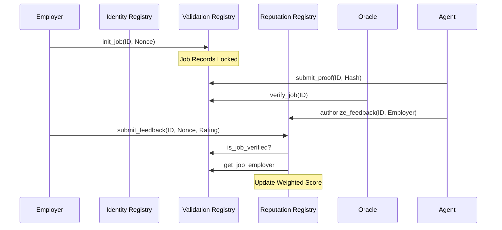

# Technical Specification: MX-8004 (MultiversX Agent Standard) v2.0

This document provides a deep-dive specification for the **MX-8004** standard on MultiversX. It details every endpoint, storage mapper, and event across the three core registries, reflecting the actual Rust implementation (v2.0).

---

## 1. Identity Registry Contract
**Role**: The primary directory for AI Agents. Handles the lifecycle of Agent Identities via Dynamic (Soulbound) NFTs.

### 1.1. Data Structures
```rust
pub struct AgentDetails {
    pub name: ManagedBuffer,
    pub uri: ManagedBuffer,
    pub public_key: ManagedBuffer,
    pub owner: ManagedAddress,
}
```

### 1.2. Storage Mappers
- `agentTokenId`: `NonFungibleTokenMapper` - The TokenID of the Agent NFT collection.
- `agentTokenNonce`: `SingleValueMapper<u64>` - Counter for NFT nonces.

### 1.3. Endpoints & Logic

#### `issue_token(token_display_name, token_ticker)`
- **Logic**: Issues the NFT collection and sets all required roles (`ESDTRoleNFTCreate`, `ESDTRoleNFTUpdateAttributes`).
- **Access Control**: **Owner Only**.
- **Payment**: Requires EGLD for issuance cost.

#### `register_agent(name, uri, public_key)`
- **Logic**: Increments nonce, creates `AgentDetails`, and mints a Soulbound NFT. The NFT is sent to the caller.
- **Access Control**: **Public** (once token is issued).
- **Security**: The transfer role is kept by the contract to ensure the NFT remains soulbound.

#### `update_agent(nonce, new_uri, new_public_key)`
- **Logic**: Fetches current `AgentDetails`, verifies ownership, updates metadata, and commits changes back to the NFT attributes.
- **Access Control**: **NFT Owner Only**.

### 1.4. Events
- `agentRegistered(owner, nonce, data)`: Emitted upon successful registration.
- `agentUpdated(nonce, uri)`: Emitted when profile is modified.

---

## 2. Validation Registry Contract
**Role**: The "Judge" that tracks job lifecycles and verifies proof of performance.

### 2.1. Job Lifecycle
Jobs transition through states defined in the `JobStatus` enum: `Pending` -> `Verified`.

### 2.2. Endpoints

#### `init_job(job_id, agent_nonce)`
- **Logic**: Initializes a job record, storing the employer address and creation timestamp (for TTL).
- **Access Control**: **Public (Employer)**.

#### `submit_proof(job_id, proof)`
- **Logic**: Stores the proof (e.g., a hash or data URI) and sets status to `Pending`.
- **Access Control**: **Public (Agent)**. *Note: Verifies job is initialized.*

#### `verify_job(job_id)`
- **Logic**: Finalizes the job state to `Verified`.
- **Access Control**: **Owner Only (Oracle)**.

#### `clean_old_jobs(job_ids)`
- **Logic**: Clears storage for jobs older than **3 days** to optimize gas and blockchain footprint.
- **Access Control**: **Public**.

### 2.3. Events
- `jobVerified(job_id, agent_nonce, status)`: Emitted once the Oracle confirms the proof.

---

## 3. Reputation Registry Contract
**Role**: A trust aggregator that prevents Sybil attacks and ensures authentic feedback.

### 3.1. Reputation Formula
Reputation is updated using a weighted average:
`NewScore = ((CurrentScore * (TotalJobs - 1)) + Rating) / TotalJobs`

### 3.2. Endpoints

#### `submit_feedback(job_id, agent_nonce, rating)`
- **Logic**: 
    1. Verifies job is `Verified` in `ValidationRegistry`.
    2. Verifies caller is the original `Employer`.
    3. Verifies agent has `authorized` this feedback.
    4. Updates `reputationScore` and `totalJobs`.
- **Access Control**: **Job Employer**.

#### `authorize_feedback(job_id, client)`
- **Logic**: Opens the "Authorization Gate" for a specific employer to leave feedback.
- **Access Control**: **Agent Owner** (Assumed auth context).

#### `append_response(job_id, response_uri)`
- **Logic**: Allows an agent to respond to feedback by providing a URI to counter-evidence.
- **Access Control**: **NFT Owner Only**. *Verified via Identity Registry attributes.*

### 3.3. Security Mechanisms
- **Frontrunning Protection**: Only the employer recorded during `init_job` can rate.
- **Authorization Gate**: Agents must approve clients before they can submit feedback.
- **Cross-Contract Proof**: Uses proxies to query `ValidationRegistry` and `IdentityRegistry` for every critical action.

---

## 4. Architecture Interaction Map



---

## 5. Security Summary Table

| Interaction | Registry | Access Control | Security Logic |
| :--- | :--- | :--- | :--- |
| **Identity Creation** | Identity | Public | Soulbound NFT Minting |
| **Job Setup** | Validation | Employer | Timestamp anchoring (TTL) |
| **Proof Submission** | Validation | Agent | Requires initialized Job ID |
| **Verification** | Validation | Owner (Oracle) | Protected state transition |
| **Feedback** | Reputation | Employer | Validation + Authorization Gate |
| **Response** | Reputation | Agent | Attribute-based ownership check |
