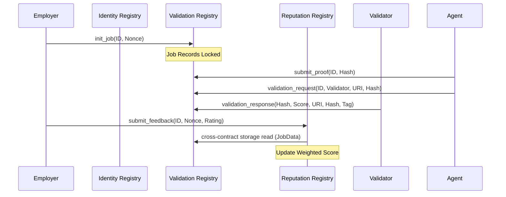

# Technical Specification: MX-8004 (MultiversX Agent Standard) v2.1

This document provides a deep-dive specification for the **MX-8004** standard on MultiversX. It details every endpoint, storage mapper, and event across the three core registries, reflecting the actual Rust implementation (v2.1).

---

## 1. Identity Registry Contract
**Role**: The primary directory for AI Agents. Handles the lifecycle of Agent Identities via Dynamic (Soulbound) NFTs.

### 1.1. Data Structures
```rust
pub struct MetadataEntry {
    pub key: ManagedBuffer,
    pub value: ManagedBuffer,
}

pub struct AgentDetails {
    pub name: ManagedBuffer,
    pub uri: ManagedBuffer,
    pub public_key: ManagedBuffer,
    pub owner: ManagedAddress,
    pub metadata: ManagedVec<MetadataEntry>,
}
```

### 1.2. Storage Mappers
- `agentTokenId`: `NonFungibleTokenMapper` - The TokenID of the Agent NFT collection.
- `agentTokenNonce`: `SingleValueMapper<u64>` - Counter for NFT nonces.
- `agentIdByAddress`: `MapMapper<ManagedAddress, u64>` - Maps owner addresses to agent nonces.
- **NEW**: `agentServicePrice(nonce, service_id)`: `SingleValueMapper<BigUint>` - High-performance storage for service costs.
- **NEW**: `agentServicePaymentToken(nonce, service_id)`: `SingleValueMapper<EgldOrEsdtTokenIdentifier>` - Supported payment token.
- **NEW**: `agentServicePaymentNonce(nonce, service_id)`: `SingleValueMapper<u64>` - SFT/NFT nonce for payment.

### 1.3. Endpoints & Logic

#### `issue_token(token_display_name, token_ticker)`
- **Logic**: Issues the NFT collection and sets all required roles (`ESDTRoleNFTCreate`, `ESDTRoleNFTUpdateAttributes`).
- **Access Control**: **Owner Only**.
- **Payment**: Requires EGLD for issuance cost.

#### `register_agent(name, uri, public_key, metadata?)`
- **Arguments**:
  - `name: ManagedBuffer` - Display name of the agent
  - `uri: ManagedBuffer` - URI pointing to ARF JSON manifest
  - `public_key: ManagedBuffer` - Public key for signature verification
  - `metadata: OptionalValue<ManagedVec<MetadataEntry>>` - Optional key-value pairs (EIP-8004 compatible)
- **Logic**: Increments nonce, creates `AgentDetails`, mints a Soulbound NFT, and **synchronizes pricing metadata** (`price:`, `token:`, `pnonce:`) into contract storage.
- **Access Control**: **Public** (once token is issued).

#### `update_agent(new_uri, new_public_key, metadata?)`
- **Interaction**: **Transfer-Execute**. Send Agent NFT to contract.
- **Logic**: Verifies NFT ownership via payment nonce, updates attributes, and **re-synchronizes pricing metadata**. Returns NFT to sender.
- **Access Control**: **NFT Owner Only**.

#### `set_metadata(nonce, entries)`
- **Logic**: Upserts metadata entries for an agent and updates pricing storage mappers if pricing keys are changed.
- **Access Control**: **NFT Owner Only**.

#### `get_metadata(nonce, key) -> OptionalValue<ManagedBuffer>`
- **Logic**: Returns the value for a specific metadata key.
- **Access Control**: **Public View**.

#### `get_agent(nonce) -> AgentDetails`
- **Logic**: Returns full agent details including metadata.
- **Access Control**: **Public View**.

#### `get_agent_id(address) -> u64`
- **Logic**: Returns the agent nonce for a registered owner address.
- **Access Control**: **Public View**.

### 1.4. Events
- `agentRegistered(owner, nonce, data)`: Emitted upon successful registration.
- `agentUpdated(nonce, uri)`: Emitted when profile is modified.
- `metadataUpdated(nonce)`: Emitted when metadata is updated via `set_metadata`.

---

## 2. Validation Registry Contract
**Role**: The "Judge" that tracks job lifecycles and verifies proof of performance.

### 2.1. Job Lifecycle
Jobs transition through states defined in the `JobStatus` enum: `New` -> `Pending` -> `ValidationRequested` -> `Verified`.
- **New**: Initialized by the employer.
- **Pending**: Proof submitted by the agent.
- **ValidationRequested**: Agent nominated a validator via `validation_request`.
- **Verified**: Validator responded via `validation_response`.

### 2.2. Endpoints

#### `init_job_with_payment(job_id, agent_nonce, service_id)`
- **Arguments**:
    - `job_id: ManagedBuffer` - Unique identifier for the job
    - `agent_nonce: u64` - Nonce of the agent on the Identity Registry
    - `service_id: ManagedBuffer` - ID of the service being purchased (e.g. `chat`)
- **Logic**: 
    1. Reads agent owner, price, token, and nonce from `IdentityRegistry`.
    2. Validates that the total sent payment matches the required token/nonce and meets the minimum price.
    3. Forwards payment to the agent owner.
    4. Records the job state as `New`.
- **Access Control**: **Public (Employer)**.

#### `submit_proof(job_id, proof)`
- **Logic**: Stores the proof (e.g., a hash or data URI) and sets status to `Pending`.
- **Access Control**: **Public (Agent)**. *Note: Verifies job is initialized.*

#### `validation_request(job_id, validator_address, request_uri, request_hash)`
- **Logic**: Agent owner nominates a validator. Sets status to `ValidationRequested`. Records the `ValidationRequestData`.
- **Access Control**: **Agent Owner** (verified via Identity Registry cross-contract read).
- **ERC-8004**: Corresponds to the `validationRequest` function in the official spec.

#### `validation_response(request_hash, response, response_uri, response_hash, tag)`
- **Logic**: The nominated validator submits a response (score 0-100). Sets status to `Verified`.
- **Access Control**: **Nominated Validator Only**.
- **ERC-8004**: Corresponds to the `validationResponse` function in the official spec.

#### `clean_old_jobs(job_ids)`
- **Logic**: Clears storage for jobs older than **3 days** to optimize gas and blockchain footprint.
- **Access Control**: **Public**.

### 2.3. Events
- `validationRequestEvent(job_id, agent_nonce, validator_address, request_uri, request_hash)`: Emitted when a validator is nominated.
- `validationResponseEvent(request_hash, response, response_hash, tag)`: Emitted when a validator responds.

---

## 3. Reputation Registry Contract
**Role**: A trust aggregator that prevents Sybil attacks and ensures authentic feedback.

### 3.1. Reputation Formula
Reputation is updated using a weighted average:
`NewScore = ((CurrentScore * (TotalJobs - 1)) + Rating) / TotalJobs`

### 3.2. Endpoints

#### `submit_feedback(job_id, agent_nonce, rating)`
- **Logic**: 
    1. Verifies job exists in `ValidationRegistry` via cross-contract storage read.
    2. Verifies caller is the original `Employer` recorded during `init_job`.
    3. Checks no duplicate feedback has been given for this job.
    4. Updates `reputationScore` and `totalJobs` using cumulative moving average.
- **Access Control**: **Job Employer**.

#### `append_response(job_id, response_uri)`
- **Logic**: Anyone can append a response URI to a job's feedback (e.g., agent counter-evidence, aggregator tags).
- **Access Control**: **Public** (ERC-8004 compliant — no caller check).

### 3.3. Security Mechanisms
- **Frontrunning Protection**: Only the employer recorded during `init_job` can rate.
- **Duplicate Prevention**: `hasGivenFeedback` flag prevents multiple ratings per job.
- **Cross-Contract Proof**: Uses `storage_mapper_from_address` to read `JobData` from `ValidationRegistry` — no async calls, same-shard only.

---

## 4. Architecture Interaction Map



---

## 5. Security Summary Table

| Interaction | Registry | Access Control | Security Logic |
| :--- | :--- | :--- | :--- |
| **Identity Creation** | Identity | Public | Soulbound NFT Minting |
| **Job Setup** | Validation | Employer | Timestamp anchoring (TTL) |
| **Proof Submission** | Validation | Agent | Requires initialized Job ID |
| **Validation Request** | Validation | Agent Owner | Cross-contract ownership check |
| **Validation Response** | Validation | Nominated Validator | Only the requested validator can respond |
| **Feedback** | Reputation | Employer | Cross-contract employer verification |
| **Response** | Reputation | Public | ERC-8004 permissionless append |
