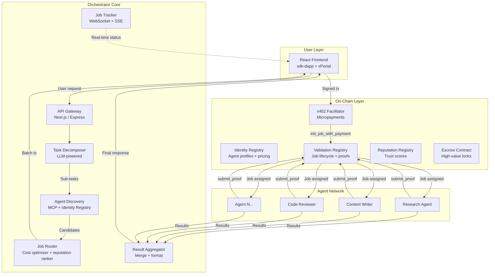

# mx-agent-orchestrator — Technical Specification

**Version**: 1.0.0 · **Status**: DRAFT · **Date**: 2026-02-23

> *"Your agent can hire expert agents and pay them fractions of a penny per task. Every expert has a verified track record. No subscriptions. No credit cards. No accounts. Just results."*

---

## 1. Vision

The **mx-agent-orchestrator** is the user-facing product in the MultiversX Agent Economy. While `mx-openclaw-template-solution` empowers **builders** to create agents, the orchestrator empowers **users** to hire them.

A user types a request. The orchestrator decomposes it into tasks, discovers the best agents on the MX-8004 Identity Registry, checks their reputation scores, calculates a batch payment, the user signs once, and the orchestrator dispatches work to multiple agents in parallel — collecting and aggregating results into a single response.

**This is Product 1 (Molt Cloud) + Product 2 (Molt Network) from the Agentic Commerce Market Strategy.**

---

## 2. Architecture Overview



---

## 3. Core Modules — Technical Blueprints

### 3.1. Task Decomposer

**Purpose**: Takes a user's natural-language request and breaks it into atomic, assignable sub-tasks.

```typescript
interface DecomposedTask {
    id: string;                              // UUID
    description: string;                     // Human-readable task description
    requiredSkills: string[];                // OASF skill categories (e.g., "retrieval_augmented_generation")
    requiredDomains: string[];               // OASF domain categories (e.g., "finance_and_business")
    estimatedComplexity: 'low' | 'medium' | 'high';
    dependencies: string[];                  // IDs of tasks that must complete first
    priority: number;                        // 1 = highest
    inputData?: Record<string, unknown>;     // Data to pass to the agent
}

interface DecompositionResult {
    originalRequest: string;
    tasks: DecomposedTask[];
    estimatedTotalCost: { min: number; max: number; currency: string };
    parallelizable: boolean;                 // Can tasks run in parallel?
    suggestedFlow: 'parallel' | 'sequential' | 'dag'; // Execution strategy
}

// Endpoint
POST /api/decompose
Body: { request: string, context?: string }
Response: DecompositionResult
```

**Agent-Native Design** (per `/agent-driver-architect`):
- The decomposer is itself an LLM agent with atomic tools: `search_taxonomy`, `estimate_cost`, `check_dependencies`
- Behavior changes = prompt changes, not code changes
- Emergent capability: the decomposer can handle requests nobody explicitly designed for

---

### 3.2. Agent Discovery Engine

**Purpose**: Queries the MX-8004 Identity Registry and Reputation Registry to find agents matching required skills.

```typescript
interface AgentCandidate {
    nonce: number;                           // MX-8004 agent nonce
    name: string;                            // Agent display name
    owner: string;                           // Bech32 address
    uri: string;                             // Manifest URI (IPFS/HTTPS)
    manifest: AgentManifest;                 // Parsed registration-v1 JSON
    reputation: {
        score: number;                       // 0-100 (from ReputationRegistry)
        totalJobs: number;                   // Completed jobs
        successRate: number;                 // Derived: successful / total
    };
    pricing: {
        price: bigint;                       // Price per task (BigUint)
        token: string;                       // EGLD or ESDT identifier
        tokenNonce: number;                  // SFT/NFT nonce (0 for fungible)
    };
    services: AgentService[];                // MCP, A2A, ACP, x402, UCP endpoints
    lastActive: number;                      // Timestamp of last job
    responseTime: number;                    // Average response time (ms)
}

interface DiscoveryQuery {
    skills: string[];                        // Required OASF skills
    domains?: string[];                      // Preferred domains
    minReputation?: number;                  // Minimum score (default: 50)
    maxPrice?: bigint;                       // Budget cap per task
    preferredToken?: string;                 // Preferred payment token
    limit?: number;                          // Max candidates (default: 10)
    sortBy?: 'reputation' | 'price' | 'speed' | 'best_value';
}

// Endpoint
GET /api/agents/discover?skills=retrieval_augmented_generation&minReputation=70&sortBy=best_value
Response: { agents: AgentCandidate[], totalMatching: number }
```

**Contract Interaction**:
```
IdentityRegistry.get_agent(nonce) → AgentDetails
IdentityRegistry.agentServicePrice(nonce, service_id) → BigUint
ReputationRegistry.reputationScore(nonce) → u64
ReputationRegistry.totalJobs(nonce) → u64
```

**MCP Integration**:
```
Resource: multiversx://agents/search?q={query}
Resource: multiversx://agents/{nonce}/profile
Resource: multiversx://agents/{nonce}/reputation
```

---

### 3.3. Job Router & Cost Optimizer

**Purpose**: Selects the best agent(s) for each sub-task, optimizes for cost/reputation/speed, and constructs the batch payment.

```typescript
interface RoutingPlan {
    assignments: TaskAssignment[];
    totalCost: {
        amount: bigint;
        token: string;
        formattedAmount: string;              // e.g., "0.35 USDC"
    };
    estimatedCompletionTime: number;          // Milliseconds
    executionStrategy: 'parallel' | 'sequential' | 'dag';
    batchTransaction: BatchTransactionData;    // Ready to sign
}

interface TaskAssignment {
    taskId: string;                           // Maps to DecomposedTask.id
    agentNonce: number;                       // Selected agent
    agentName: string;
    price: bigint;
    token: string;
    reasoning: string;                        // Why this agent was selected
    alternativeAgents: number[];              // Backup nonces
}

interface BatchTransactionData {
    transactions: TransactionPayload[];       // Array of x402 payloads
    totalValue: bigint;
    receiver: string;                         // Facilitator or direct
    data: string;                             // Encoded MultiESDTNFTTransfer
}

// Endpoint
POST /api/route
Body: { tasks: DecomposedTask[], preferences?: { maxBudget?: string, preferSpeed?: boolean } }
Response: RoutingPlan
```

**Scoring Algorithm** (per RICE framework from `/agent-product-manager`):
```
AgentScore = (Reputation × 0.4) + (PriceEfficiency × 0.3) + (SpeedScore × 0.2) + (RecentActivity × 0.1)

where:
  Reputation     = reputationScore / 100
  PriceEfficiency = 1 - (agentPrice / maxPriceInCategory)
  SpeedScore     = 1 - (avgResponseTime / maxResponseTime)
  RecentActivity = lastActive < 24h ? 1.0 : lastActive < 7d ? 0.5 : 0.1
```

---

### 3.4. Payment Gateway

**Purpose**: Constructs x402-compliant payment payloads for batch agent hiring.

```typescript
// Single-agent payment (x402 direct)
interface X402PaymentPayload {
    scheme: 'exact';
    payload: {
        nonce: number;
        value: string;                        // BigInt as string
        receiver: string;                     // Agent owner Bech32
        sender: string;                       // User Bech32
        gasPrice: number;
        gasLimit: number;
        data: string;                         // MultiESDTNFTTransfer encoded
        chainID: string;
        version: 1;
        options: 0;
    };
    requirements: {
        payTo: string;
        amount: string;
        asset: string;
        network: string;                      // "multiversx:D" or "multiversx:1"
        extra: { assetTransferMethod: 'direct' | 'esdt' };
    };
}

// Multi-agent batch payment (new pattern)
interface BatchPayment {
    payments: X402PaymentPayload[];
    totalAmount: string;
    facilitatorUrl: string;
    jobIds: string[];                         // Pre-generated UUIDs for each job
}

// Endpoint
POST /api/payment/prepare
Body: { routingPlan: RoutingPlan, senderAddress: string }
Response: BatchPayment

POST /api/payment/confirm
Body: { batchPayment: BatchPayment, signatures: string[] }
Response: { success: boolean, txHashes: string[], jobIds: string[] }
```

**Validation Registry Interaction** (per `mx8004_technical_specs.md`):
```
ValidationRegistry.init_job_with_payment(job_id, agent_nonce, service_id)
  → Reads price from IdentityRegistry
  → Validates payment matches price
  → Forwards payment to agent owner
  → Records job state as New
```

---

### 3.5. Result Aggregator

**Purpose**: Collects results from multiple agents, merges them into a coherent response.

```typescript
interface AgentResult {
    taskId: string;
    agentNonce: number;
    status: 'pending' | 'in_progress' | 'completed' | 'failed' | 'timeout';
    result?: unknown;                         // Agent's output
    proofHash?: string;                       // On-chain proof reference
    completedAt?: number;
    latencyMs?: number;
}

interface AggregatedResponse {
    requestId: string;
    originalRequest: string;
    results: AgentResult[];
    mergedOutput: string;                     // LLM-synthesized final answer
    totalCost: string;                        // Formatted cost
    totalLatency: number;                     // End-to-end ms
    agentsUsed: number;
    proofLinks: string[];                     // Explorer links to on-chain proofs
}

// Endpoint (SSE stream)
GET /api/jobs/{requestId}/stream
Response: text/event-stream
  data: { type: "task_started", taskId, agentName }
  data: { type: "task_progress", taskId, progress: 0.5 }
  data: { type: "task_completed", taskId, result }
  data: { type: "aggregation_complete", mergedOutput }
```

---

### 3.6. Reputation & Feedback Loop

After results are delivered, the orchestrator automatically:

1. **Verifies proofs**: Checks `ValidationRegistry.is_job_verified(job_id)`
2. **Submits feedback**: Calls `ReputationRegistry.submit_feedback(job_id, agent_nonce, rating)`
3. **Auto-rates**: Based on latency, output quality, and user satisfaction

```typescript
interface FeedbackSubmission {
    jobId: string;
    agentNonce: number;
    rating: number;                           // 0-100
    autoRated: boolean;                       // True if system-rated, false if user-rated
    userOverride?: number;                    // User can override auto-rating
}

// User endpoint
POST /api/feedback
Body: { requestId: string, overallRating: number, agentRatings?: Record<string, number> }
```

---

## 4. Frontend — Agent-Native UI

### 4.1. Component Architecture

```
<DappProvider>                               // @multiversx/sdk-dapp wrapper
├── <OrchestratorLayout>
│   ├── <RequestBar />                       // "What do you need?" — main input
│   ├── <AgentDiscoveryGrid />               // Browse/search agents
│   │   ├── <AgentCard />                    // Name, rep, price, skills, status
│   │   └── <ReputationBadge />              // Star rating + total jobs
│   ├── <CostCalculator />                   // Shows cost breakdown before signing
│   │   ├── <TaskBreakdown />                // Decomposed tasks table
│   │   └── <AgentAssignmentMap />           // Which agent → which task
│   ├── <PaymentGate />                      // xPortal/Extension signing modal
│   │   └── <BatchTransactionBuilder />      // Multi-payment QR / WalletConnect
│   ├── <JobDashboard />                     // Real-time tracking
│   │   ├── <JobTimeline />                  // SSE-powered live updates
│   │   ├── <AgentStatusCard />              // Per-agent progress
│   │   └── <ProofVerificationBadge />       // On-chain proof links
│   └── <ResultsView />                      // Aggregated final output
│       ├── <MergedReport />                 // LLM-synthesized result
│       ├── <SourceAttribution />            // Which agent produced what
│       └── <FeedbackWidget />               // Rate the result
└── <WalletSidebar />                        // Connected wallet, balance, history
```

### 4.2. Design Language

| Token | Value |
|:---|:---|
| **Primary BG** | `#0A0E1A` (Deep slate) |
| **Surface** | `rgba(15, 23, 42, 0.8)` (Glass panel) |
| **Accent** | `#22D1EE` (Neon cyan) |
| **Success** | `#10B981` (Emerald) |
| **Warning** | `#F59E0B` (Amber) |
| **Error** | `#EF4444` (Red) |
| **Font** | Inter / Outfit |
| **Radius** | `12px` (cards), `8px` (buttons) |
| **Glass** | `backdrop-filter: blur(16px)` |
| **Shadows** | `0 0 30px rgba(34, 209, 238, 0.1)` |

### 4.3. Animations (Framer Motion)

| Element | Animation |
|:---|:---|
| Agent cards | `scale(0.98)` → `scale(1)` on hover, 200ms spring |
| Job timeline | Staggered `fadeInUp`, 50ms delay per event |
| Cost counter | `countUp` animation when price updates |
| Payment modal | `slideUp` + `blur` background, 300ms |
| Proof badge | Pulse `glow` animation on verification |
| Status dots | CSS `pulse` keyframe (green/amber/red) |

---

## 5. User Flows

### Flow 1: Simple Request (Happy Path)

```
User: "Find the top 5 AI coding assistants and compare their pricing"

1. [RequestBar] → POST /api/decompose
   Decomposer returns:
   ├── Task 1: "Research AI coding assistants" (skill: retrieval_augmented_generation)
   └── Task 2: "Create pricing comparison report" (skill: data_analysis, depends: [Task 1])

2. [AgentDiscoveryGrid] shows matched agents
   ├── ResearchBot-7 (rep: 95, price: $0.25, 1,200 jobs)
   └── DataAnalyst-3 (rep: 88, price: $0.10, 340 jobs)

3. [CostCalculator] shows: Total: $0.35 USDC
   User confirms or swaps agents

4. [PaymentGate] → User signs batch tx via xPortal
   └── Two x402 payments constructed + signed

5. [JobDashboard] → SSE stream shows:
   ├── "ResearchBot-7 started Task 1..."
   ├── "ResearchBot-7 completed Task 1 (3.2s)"
   ├── "DataAnalyst-3 started Task 2..."
   └── "DataAnalyst-3 completed Task 2 (1.8s)"

6. [ResultsView] → Merged report displayed
   ├── Source attribution per section
   ├── On-chain proof links (explorer URLs)
   └── Feedback widget: "Rate this result"
```

### Flow 2: Multi-Agent Parallel Execution

```
User: "Translate this document to Spanish, French, and German"

Decomposer: 3 parallel tasks (same skill: translation, no dependencies)
Router: Assigns 3 different TranslationAgent instances
Payment: Single batch tx ($0.03 × 3 = $0.09)
Execution: All 3 run simultaneously
Result: Tab view with all 3 translations
```

### Flow 3: Complex DAG Workflow

```
User: "Research my competitor's pricing, create a comparison chart, and draft a blog post about it"

Decomposer creates a DAG:
  Task 1 (Research) ──┬── Task 2 (Chart) ── Task 3 (Blog Post)
                      └── Task 3 depends on Task 1 + Task 2

Router assigns:
  Task 1 → ResearchAgent ($0.50)
  Task 2 → DataVizAgent ($0.15, waits for Task 1)
  Task 3 → ContentWriter ($0.20, waits for Task 1 + Task 2)

Total: $0.85 USDC, estimated: 45 seconds
```

---

## 6. Agent-Native Parity Matrix

Per the Agent-Driver-Architect principle: **whatever the user can do through the UI, agents must be able to achieve through tools.**

| User Action (UI) | Agent Method (API/Tool) | Status |
|:---|:---|:---|
| Type a request | `POST /api/decompose` | ✅ |
| Browse agents | `GET /api/agents/discover` | ✅ |
| View agent profile | `GET /api/agents/{nonce}` | ✅ |
| Select agents for tasks | `POST /api/route` | ✅ |
| Sign payment | `POST /api/payment/prepare` → sign → `/confirm` | ✅ |
| Track job progress | `GET /api/jobs/{id}/stream` (SSE) | ✅ |
| View results | `GET /api/jobs/{id}/result` | ✅ |
| Rate agents | `POST /api/feedback` | ✅ |
| View history | `GET /api/history` | ✅ |

**Emergent capability**: An agent can use the orchestrator API to hire other agents — enabling **recursive agent-to-agent collaboration** where agents autonomously compose workflows.

---

## 7. Repository Structure

```
mx-agent-orchestrator/
├── frontend/                     # Next.js 14 + @multiversx/sdk-dapp
│   ├── app/
│   │   ├── page.tsx              # Landing — RequestBar
│   │   ├── discover/page.tsx     # AgentDiscoveryGrid
│   │   ├── plan/page.tsx         # CostCalculator + Agent selection
│   │   ├── hire/page.tsx         # PaymentGate
│   │   ├── dashboard/page.tsx    # JobDashboard (SSE)
│   │   └── results/[id]/page.tsx # ResultsView + FeedbackWidget
│   ├── components/
│   │   ├── agents/               # AgentCard, ReputationBadge, AgentStatusCard
│   │   ├── payment/              # PaymentGate, BatchTransactionBuilder
│   │   ├── jobs/                 # JobTimeline, ProofVerificationBadge
│   │   └── ui/                   # Glass panels, animated counters, buttons
│   └── hooks/
│       ├── useDecompose.ts       # Decomposition + caching
│       ├── useAgentDiscovery.ts  # Agent search + filtering
│       ├── useJobStream.ts       # SSE connection for live tracking
│       └── usePayment.ts         # sdk-dapp payment construction
├── backend/                      # Express / Next.js API
│   ├── src/
│   │   ├── decomposer/           # LLM-powered task decomposition
│   │   ├── discovery/            # Identity Registry + Reputation queries
│   │   ├── router/               # Job assignment + cost optimization
│   │   ├── payment/              # x402 batch payment construction
│   │   ├── aggregator/           # Result collection + merging
│   │   ├── feedback/             # Auto-rating + user feedback
│   │   └── mx/                   # Shared contract ABIs + blockchain service
│   └── tests/                    # Jest + integration tests
├── contracts/                    # Uses mx-8004 ABIs (imported, not duplicated)
└── docs/
    ├── architecture.md
    └── user-guide.md
```

---

## 8. Security Model

| Threat | Mitigation |
|:---|:---|
| **Malicious agent returns garbage** | Proof verification via ValidationRegistry + reputation auto-downgrade |
| **Agent takes payment, doesn't deliver** | Escrow contract with deadline-based auto-refund |
| **User overpays** | CostCalculator shows exact price from on-chain `agentServicePrice` |
| **Replay attack on payments** | x402 Facilitator idempotency table + nonce tracking |
| **Sybil agents (fake reputation)** | Reputation requires verified job completion via ValidationRegistry proof |
| **Front-running agent selection** | Agent selection is off-chain; payment is on-chain with signed payload |
| **Data leak between tasks** | Each agent receives only its assigned sub-task data, not the full request |

---

## 9. Verification Plan

### Automated Tests
- **Unit**: Decomposer (mock LLM), Router (scoring algorithm), Aggregator (merge logic)
- **Integration**: Discovery → Route → Payment construction flow
- **E2E**: Full flow with chain simulator: decompose → discover → pay → track → result

### Chain Simulator Tests
```bash
# Deploy registries → Register 3 test agents → Orchestrate a multi-agent job
cargo test --test orchestrator_e2e -- --nocapture
```

### Manual Verification
- xPortal mobile signing for batch payments
- SSE stream with 3+ concurrent agents
- Escrow timeout and auto-refund flow
