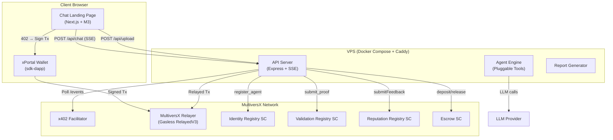

# 🧩 mx-openclaw-template-solution — Comprehensive Implementation Plan

*Version 3.0 — Base Template + Derivative Architecture*

---

## 1. Naming & Repo Strategy

| Repository | Role | Description |
|:---|:---|:---|
| **`mx-openclaw-template-solution`** | **Base Template** | A generic, agent-agnostic shell. Contains the chat frontend, payment server, VPS deploy scripts, and all MultiversX integrations. The agent itself is a pluggable interface. |
| **`mx-openclaw-market-research`** | **First Derivative** | Forks `mx-openclaw-template-solution` and adds market research tools (`search_web`, `scrape_page`, `generate_report`). |
| *(future)* `mx-openclaw-content-writer` | Derivative | Adds content writing / SEO tools. |
| *(future)* `mx-openclaw-code-auditor` | Derivative | Adds code auditing / security tools. |

> The base template makes **no assumptions** about what the agent does. It only assumes that:
> 1. The agent receives a text prompt (and optional file uploads).
> 2. The agent streams back text results.
> 3. The agent gets paid per query via MultiversX x402.

---

## 2. Architecture



---

## 3. 🔍 Integration Verification (@mvx-integration-specialist)

### Payment Flow Verification

| Step | Component | Integration Point | Status |
|:---|:---|:---|:---|
| 1. Client requests research | Frontend → `POST /api/chat` | REST | ✅ Standard |
| 2. Backend checks payment | Backend → `facilitator.prepare()` | HTTP to Facilitator | ✅ Existing in `facilitator.ts` |
| 3. Backend returns 402 | Backend → Frontend | HTTP 402 + payment URI | ✅ Standard HTTP |
| 4. Frontend prompts payment | `sdk-dapp` → xPortal | `sendTransactions()` | ✅ Per `@mvx-dapp-architect` pattern |
| 5. Client signs tx | xPortal signs | RelayedV3 | ⚠️ **Verify**: relayer + sender must be same shard |
| 6. Facilitator confirms | Facilitator polls chain | `awaitCompletedTransaction` | ✅ Existing in `x402_facilitator` |
| 7. Backend starts agent | `facilitator.onPayment()` | Event callback | ✅ Existing in `index.ts` |
| 8. Agent submits proof | `validator.submitProof()` | RelayedV3 to Validation SC | ✅ Full flow in `validator.ts` |

### Identified Integration Risks

> [!WARNING]
> **Shard Alignment:** RelayedV3 requires sender and relayer to be in the same shard. The `moltbot-starter-kit` already handles this via `GET /relayer/address/:address` (line 48-51 in `index.ts`), which returns a shard-aware relayer. The template MUST preserve this pattern.

> [!IMPORTANT]
> **Gas Overhead:** All relayed transactions must add `+50,000` gas. Already handled in `config.ts` (`RELAYER_GAS_OVERHEAD: 50000n`) and applied in `validator.ts` (line 73). The template MUST preserve this.

> [!NOTE]
> **Auto-Registration:** If the agent is not registered on Identity SC, `validator.ts` auto-registers on 403 (lines 116-134). This includes PoW challenge solving. The template MUST include `pow.ts` for this.

### SDK Version Alignment

| Package | Required Version | Notes |
|:---|:---|:---|
| `@multiversx/sdk-core` | v15+ | Uses `Entrypoint` pattern, `createSmartContractTransactionsFactory` |
| `@multiversx/sdk-wallet` | v4+ | `UserSigner.fromPem()` |
| `@multiversx/sdk-network-providers` | v2+ | `ApiNetworkProvider` |
| `@multiversx/sdk-dapp` | Latest | Frontend only. `DappProvider`, `sendTransactions`, `useGetAccount` |

---

## 4. 🎨 Frontend Architecture (@frontend-squad + @mvx-typescript-specialist)

### Design System (Material Design 3)

| Token | Value | Rationale |
|:---|:---|:---|
| Primary | `#6750A4` (M3 Purple) | MultiversX brand-adjacent |
| Surface | `#1C1B1F` (dark) / `#FFFBFE` (light) | M3 standard |
| Typography | `Outfit` (headings) + `Inter` (body) | Modern, clean, good for data |
| Elevation | M3 tonal elevation | Surface tint, not shadows |
| Shape | M3 medium (12px radius) | Friendly, professional |

### Component Architecture (React)

```
frontend/
├── app/
│   ├── layout.tsx            ← DappProvider + ThemeProvider wrapper
│   ├── page.tsx              ← Landing page (hero, features, CTA)
│   └── chat/
│       └── page.tsx          ← Chat interface
├── components/
│   ├── chat/
│   │   ├── ChatWindow.tsx    ← Main container (scrollable message list)
│   │   ├── MessageBubble.tsx ← User/bot message rendering
│   │   ├── InputBar.tsx      ← Text input + file attach + send button
│   │   ├── PaymentCard.tsx   ← Inline payment prompt (amount, QR, sign button)
│   │   ├── ReportCard.tsx    ← Download button for completed research
│   │   ├── ThinkingDots.tsx  ← Typing indicator
│   │   └── FileChip.tsx      ← Uploaded file display
│   ├── landing/
│   │   ├── Hero.tsx          ← Main CTA section
│   │   ├── Features.tsx      ← Feature grid
│   │   └── AgentProfile.tsx  ← On-chain reputation display
│   └── shared/
│       ├── WalletButton.tsx  ← Connect/disconnect xPortal
│       └── Logo.tsx
├── hooks/
│   ├── useChat.ts            ← SSE stream management
│   ├── usePayment.ts         ← sendTransactions + track status
│   └── useAgent.ts           ← Fetch agent profile from /api/agent
├── services/
│   ├── api.ts                ← Axios client for backend
│   └── sse.ts                ← SSE connection helper
└── theme/
    └── m3-theme.ts           ← Material Design 3 tokens
```

### Key Frontend Integration Decisions

1. **`DappProvider` wraps the app** in `layout.tsx` — manages auth state, signing providers.
2. **`usePayment` hook** uses `sendTransactions({ transactions: [tx] })` from `sdk-dapp`, returns `sessionId`, then uses `useTrackTransactionStatus(sessionId)` for optimistic UI.
3. **SSE for streaming** — no WebSockets needed. Backend sends `text/event-stream` with `data: { type: 'text' | 'thinking' | 'complete', content: '...' }`.
4. **Static export option** — for cheaper hosting alternatives (Vercel, Netlify, GitHub Pages), the frontend can be `next export`'d and served statically. The API calls go to the VPS backend via CORS.

---

## 5. Base Template File Structure

```
mx-openclaw-template-solution/
├── backend/
│   ├── src/
│   │   ├── server.ts         ← Express server (CORS, multer, routes)
│   │   ├── routes/
│   │   │   ├── chat.ts       ← POST /api/chat (SSE stream, 402 gate)
│   │   │   ├── upload.ts     ← POST /api/upload
│   │   │   ├── download.ts   ← GET /api/download/:jobId
│   │   │   ├── agent.ts      ← GET /api/agent (on-chain profile)
│   │   │   └── health.ts     ← GET /api/health
│   │   ├── agent/
│   │   │   ├── base-agent.ts ← Abstract agent interface (tools, execute)
│   │   │   ├── tools/        ← Empty in base; derivatives add tools here
│   │   │   └── pdf.ts        ← Markdown → PDF generator
│   │   ├── mx/               ← All MultiversX integrations (copied from starter-kit)
│   │   │   ├── facilitator.ts
│   │   │   ├── validator.ts
│   │   │   ├── config.ts
│   │   │   ├── pow.ts
│   │   │   ├── skills/       ← identity, validation, reputation, escrow, transfer, discovery
│   │   │   ├── abis/         ← ABI JSON files
│   │   │   └── utils/        ← logger, entrypoint factory, abi helper
│   │   └── session/          ← Simple session manager (SQLite or in-memory)
│   ├── Dockerfile
│   ├── package.json
│   └── tsconfig.json
├── frontend/
│   ├── app/                  ← Next.js App Router pages
│   ├── components/           ← Chat, Landing, Shared components
│   ├── hooks/                ← useChat, usePayment, useAgent
│   ├── services/             ← api.ts, sse.ts
│   ├── theme/                ← M3 tokens
│   ├── Dockerfile
│   ├── package.json
│   └── next.config.js
├── scripts/
│   ├── setup.sh              ← Interactive CLI wizard
│   ├── generate_wallet.ts    ← Creates wallet.pem
│   ├── register.ts           ← On-chain agent registration
│   ├── check_balance.ts      ← Wallet balance check
│   ├── fund.ts               ← Devnet faucet request
│   └── update_manifest.ts    ← Update on-chain manifest
├── infra/
│   ├── provision.sh          ← Harden fresh Ubuntu VPS
│   ├── deploy.sh             ← SCP + docker compose up
│   ├── destroy.sh            ← Teardown
│   ├── logs.sh               ← Tail docker logs
│   ├── docker-compose.yml    ← backend + frontend + caddy
│   └── Caddyfile             ← Auto-SSL reverse proxy
├── agent.config.example.json
├── .env.example
├── .gitignore
├── package.json              ← Root scripts (setup, register, dev, build, deploy...)
└── README.md
```

---

## 6. Master Task List

### Phase 0: Repository Scaffolding
- [ ] Create `mx-openclaw-template-solution` git repo
- [ ] Create directory structure: `backend/`, `frontend/`, `scripts/`, `infra/`
- [ ] Copy MultiversX integration layer from `moltbot-starter-kit` into `backend/src/mx/`:
  - [ ] `facilitator.ts`, `validator.ts`, `config.ts`, `pow.ts`
  - [ ] `skills/` (all 10 skill files)
  - [ ] `abis/` (identity, validation, reputation ABI JSONs)
  - [ ] `utils/` (logger, entrypoint, abi helpers)
- [ ] Copy relevant scripts from `moltbot-starter-kit/scripts/` into `scripts/`:
  - [ ] `generate_wallet.ts`, `register.ts`, `check_balance.ts`, `fund.ts`, `update_manifest.ts`
- [ ] Create root `package.json` with lifecycle scripts
- [ ] Create `.gitignore` (wallet.pem, .env, node_modules, uploads/, reports/, dist/)
- [ ] Create `agent.config.example.json` with documented fields
- [ ] Create `.env.example` with all env vars documented (from `config.ts`)

### Phase 1: Backend — API Server + Agent Interface
- [ ] Create `backend/package.json` with dependencies (express, multer, cors, dotenv, axios, sdk-core, sdk-wallet, sdk-network-providers)
- [ ] Create `backend/src/server.ts`: Express server with CORS, body parsing, multer
- [ ] Create `backend/src/routes/chat.ts`:
  - [ ] Session management (UUID-based)
  - [ ] Payment gate: check session, if unpaid → `facilitator.prepare()` → return 402 with payment details
  - [ ] If paid: invoke agent, stream response via SSE (`res.setHeader('Content-Type', 'text/event-stream')`)
- [ ] Create `backend/src/routes/upload.ts`: multer file upload, return `fileId`
- [ ] Create `backend/src/routes/download.ts`: serve generated PDF by `jobId`
- [ ] Create `backend/src/routes/agent.ts`: return on-chain agent profile (name, reputation, price)
- [ ] Create `backend/src/routes/health.ts`: simple health check
- [ ] Create `backend/src/agent/base-agent.ts`: Abstract agent class with:
  - [ ] `abstract getTools(): Tool[]`
  - [ ] `abstract getSystemPrompt(): string`
  - [ ] `execute(prompt, files): AsyncGenerator<StreamEvent>` — streams tool calls + text
- [ ] Create `backend/src/agent/tools/` directory (empty in base template, README explaining how to add tools)
- [ ] Create `backend/src/agent/pdf.ts`: markdown → PDF converter
- [ ] Create `backend/src/session/session-store.ts`: simple in-memory or SQLite session store
- [ ] Wire `facilitator.onPayment()` listener to match payments → sessions
- [ ] Create `backend/Dockerfile`:
  ```dockerfile
  FROM node:22-slim
  RUN adduser --disabled-password --gecos '' agent
  WORKDIR /app
  COPY package*.json ./
  RUN npm ci --production
  COPY dist/ ./dist/
  USER agent
  CMD ["node", "dist/server.js"]
  ```

### Phase 2: Frontend — Material Design 3 Chat UI
- [ ] Initialize Next.js 15 in `frontend/` (App Router, TypeScript)
- [ ] Install dependencies: `@mui/material`, `@emotion/react`, `@emotion/styled`, `@multiversx/sdk-dapp`
- [ ] Create `frontend/theme/m3-theme.ts`: M3 color tokens, typography (Outfit + Inter), shape, elevation
- [ ] Create `frontend/app/layout.tsx`: wrap in `DappProvider` + `ThemeProvider` + font loading
- [ ] Create `frontend/app/page.tsx` — Landing Page:
  - [ ] `Hero.tsx`: bot name, tagline, price, "Start Research" CTA
  - [ ] `Features.tsx`: feature grid (Upload Docs, Real-Time Streaming, Pay Per Query, Download PDF)
  - [ ] `AgentProfile.tsx`: on-chain reputation score badge (fetched via `useAgent` hook)
- [ ] Create `frontend/app/chat/page.tsx` — Chat Interface:
  - [ ] `ChatWindow.tsx`: scrollable message list with auto-scroll
  - [ ] `MessageBubble.tsx`: user vs bot styling, markdown rendering
  - [ ] `InputBar.tsx`: text input + file attach button + send button
  - [ ] `ThinkingDots.tsx`: animated typing indicator
  - [ ] `FileChip.tsx`: attached file display with remove button
- [ ] Create `frontend/components/chat/PaymentCard.tsx`:
  - [ ] Display amount + token
  - [ ] "Pay with xPortal" button → calls `sendTransactions()` from `sdk-dapp`
  - [ ] `useTrackTransactionStatus()` for optimistic UI (pending → confirmed)
  - [ ] On confirmed: POST `/api/chat/confirm-payment` with `sessionId` + `txHash`
- [ ] Create `frontend/components/chat/ReportCard.tsx`: download button + preview
- [ ] Create `frontend/components/shared/WalletButton.tsx`: connect/disconnect xPortal
- [ ] Create `frontend/hooks/useChat.ts`: manages SSE stream lifecycle
- [ ] Create `frontend/hooks/usePayment.ts`: wraps `sendTransactions` + status tracking
- [ ] Create `frontend/hooks/useAgent.ts`: fetches `GET /api/agent`
- [ ] Create `frontend/services/api.ts`: Axios client with base URL config
- [ ] Create `frontend/services/sse.ts`: SSE connection helper with reconnect
- [ ] Create `frontend/Dockerfile`:
  ```dockerfile
  FROM node:22-slim AS builder
  WORKDIR /app
  COPY package*.json ./
  RUN npm ci
  COPY . .
  RUN npm run build
  FROM node:22-slim
  WORKDIR /app
  COPY --from=builder /app/.next ./.next
  COPY --from=builder /app/public ./public
  COPY --from=builder /app/package*.json ./
  RUN npm ci --production
  CMD ["npm", "start"]
  ```
- [ ] Responsive design: mobile-first (chat is full-screen on mobile)
- [ ] Dark mode support via M3 `color-scheme`

### Phase 3: Developer CLI & Setup Wizard
- [ ] Create `scripts/setup.sh`:
  - [ ] Prompt: Bot name, description, price (USDC), LLM provider, LLM API key, network (devnet/mainnet)
  - [ ] Generate `.env` from template
  - [ ] Generate `agent.config.json`
  - [ ] Run `npx ts-node scripts/generate_wallet.ts`
  - [ ] Print next steps: "Fund wallet → Register → Deploy"
- [ ] Adapt `scripts/register.ts` from moltbot-starter-kit (already complete)
- [ ] Adapt `scripts/check_balance.ts` from moltbot-starter-kit
- [ ] Adapt `scripts/fund.ts` for devnet faucet
- [ ] Create `scripts/dev.sh`: starts backend (nodemon) + frontend (next dev) concurrently

### Phase 4: Infrastructure & VPS Deployment
- [ ] Create `infra/provision.sh`:
  - [ ] Install Docker, Docker Compose plugin
  - [ ] Create non-root user `moltbot`
  - [ ] Configure UFW (only 22, 80, 443)
  - [ ] Install + enable Fail2Ban
  - [ ] Disable root SSH login + password auth
  - [ ] Enable automatic security updates
- [ ] Create `infra/deploy.sh`:
  - [ ] Accepts `user@ip` and `domain.com` as args
  - [ ] SCPs project files (excluding node_modules, .git)
  - [ ] Generates `Caddyfile` with provided domain
  - [ ] Runs `docker compose build && docker compose up -d`
- [ ] Create `infra/destroy.sh`: `docker compose down -v`, remove project dir
- [ ] Create `infra/logs.sh`: `ssh user@ip 'cd /app && docker compose logs -f'`
- [ ] Create `infra/docker-compose.yml`:
  - [ ] `backend` service (port 4000, internal network)
  - [ ] `frontend` service (port 3000, internal network)
  - [ ] `caddy` service (ports 80/443, auto-SSL, reverse proxy)
  - [ ] Named volumes: `uploads`, `reports`, `caddy_data`, `caddy_config`
- [ ] Create `infra/Caddyfile` with domain parameterization

### Phase 5: Documentation
- [ ] `README.md`: 5-minute walkthrough (Clone → Setup → Register → Deploy → Earn)
- [ ] `DEPLOYMENT_GUIDE.md`: detailed VPS security walkthrough
- [ ] `CUSTOMIZATION_GUIDE.md`: how to fork into a different bot type (add your own tools)
- [ ] Architecture diagram (Mermaid) in README

### Phase 6: First Derivative — mx-openclaw-market-research
- [ ] Fork `mx-openclaw-template-solution`
- [ ] Add `backend/src/agent/tools/search_web.ts` (Tavily/Serper API)
- [ ] Add `backend/src/agent/tools/scrape_page.ts` (URL text extraction)
- [ ] Add `backend/src/agent/tools/read_file.ts` (uploaded PDF/CSV reader)
- [ ] Add `backend/src/agent/tools/generate_report.ts` (markdown report synthesizer)
- [ ] Create `backend/src/agent/market-research-agent.ts` extending `BaseAgent`
- [ ] Update `agent.config.example.json` with market research defaults
- [ ] Update landing page copy for market research context

### Phase 7: Testing & Verification
- [ ] Backend unit tests (jest): chat routes, payment gate, session store
- [ ] Frontend component tests (vitest + Testing Library): ChatWindow, PaymentCard, InputBar
- [ ] Integration test on devnet: full flow (register → chat → pay → report → proof)
- [ ] Manual VPS deploy test: provision real VPS, deploy, complete paid query

---

## 7. Verification Plan

### Automated Tests
```bash
# Backend
cd backend && npm test        # jest unit tests

# Frontend
cd frontend && npm test       # vitest component tests
```

### Integration Test (Devnet)
```bash
npm run setup                 # Generate wallet + config
npm run fund                  # Get devnet tokens
npm run register              # Register on Identity SC
npm run dev                   # Start local
# Open http://localhost:3000
# 1. Click "Start Research"
# 2. Type a query
# 3. See 402 payment prompt
# 4. Connect xPortal → sign tx
# 5. See streaming response
# 6. Download PDF
# Verify: on-chain proof exists on Validation SC
```

### Manual VPS Deploy Test
1. Get a fresh Ubuntu 24.04 VPS (DigitalOcean, Hetzner, etc.)
2. Point a domain to the VPS IP
3. Run `npm run provision -- root@IP`
4. Run `npm run deploy -- moltbot@IP yourdomain.com`
5. Visit `https://yourdomain.com` — verify SSL, landing page, chat, payment flow
