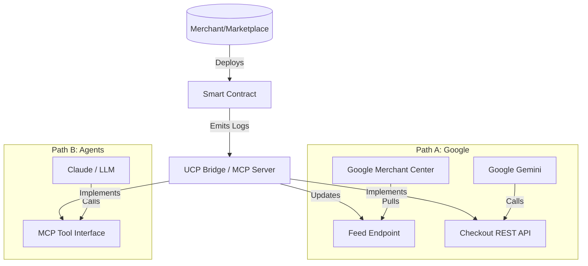

# Official Guide: MultiversX Integration for Universal Commerce Protocol (UCP)

## 1. Introduction
This document defines the **Official Standard** for integrating the MultiversX Blockchain with the Universal Commerce Protocol (UCP). By adhering to this standard, Marketplaces, dApps, and Merchants on MultiversX can ensure their assets are discoverable and purchasable by AI Agents (Google Gemini, Claude, etc.) and UCP-compliant surfaces (Google Search).

## 2. Integration Paths
There are two distinct paths to "Official" support, depending on your target audience:

### Path A: The "Google Partner" Path (Centralized)
**Target**: Appearance in Google Search "Shop with AI", Google Shopping, and Gemini App.
**Requirement**:
1.  **GMC**: A Google Merchant Center account.
2.  **Product Feed**: A specific JSON/CSV feed of your on-chain assets.
3.  **Checkout Bridge**: A hosted REST API implementing the official UCP Checkout Spec.
4.  **Waitlist**: Approval from Google.

### Path B: The "Agentic" Path (Decentralized)
**Target**: Direct interaction with AI Agents (Claude, Open Source LLMs) via the Model Context Protocol (MCP).
**Requirement**:
1.  **MCP Server**: Running the `multiversx-mcp-server` (Standard Implementation).
2.  **Listing**: submitting your endpoint to the `modelcontextprotocol` registry.

---

## 3. The MultiversX UCP Standard
To standardize the ecosystem, MultiversX provides the **Reference UCP Toolkit**.

### 3.1. Product Discovery (The Passive Indexer)
Instead of every merchant building a custom indexer, we define a **Standardized Log Event** for on-chain listings.
All UCP-compliant indexers will listen for:

```rust
// Event Name: "UCPListing"
// Topics: [TokenIdentifier, Nonce, UCP_Action ("List" | "Delist" | "Update")]
// Data: [Price, Currency] 
// Note: Metadata is NOT emitted. The Indexer resolves it from the Token/SFT attributes.
```
*Existing marketplaces (xExchange, FrameIt) are supported via "Adapter Plugins" in the Toolkit.*

### 3.2. Commerce & Checkout (The MCP Server)
The official `multiversx-mcp-server` acts as the bridge.
*   **Role**: It connects AI Agents to the Blockchain.
*   **Security**: It verifies that the listing comes from a **Whitelisted Smart Contract**.
*   **Slippage**: It handles concurrency by relying on robust Smart Contract revert logic.

---

## 4. How to Integrate (For Marketplaces)

### Step 1: Emit Standard Events (Or Submit an Adapter PR)
If you are a Marketplace Smart Contract developer, either:
*   Update your contract to emit `UCPListing`.
*   OR submit a Typescript Adapter to the `multiversx-mcp-server` repository that parses your existing proprietary events.

### Step 2: Deploy the UCP Bridge
Run the `multiversx-ucp-bridge` Docker container.
*   **Config**: Provide your `GMC_MERCHANT_ID` (for Path A) and `MVX_API_URL`.
*   **Output**:
    *   `GET /feed.json`: Your Google Merchant Center compliant feed.
    *   `POST /checkout`: The UCP-compliant checkout endpoint.

---

## 5. Architecture Diagram


## 6. Next Steps for Core Devs
1.  **Build the `multiversx-mcp-server`**: This covers Path B and serves as the core logic for Path A.
2.  **Build the Feed Generator**: A module within the server to export `products.json`.
3.  **Documentation**: Publish this guide to `docs.multiversx.com`.
